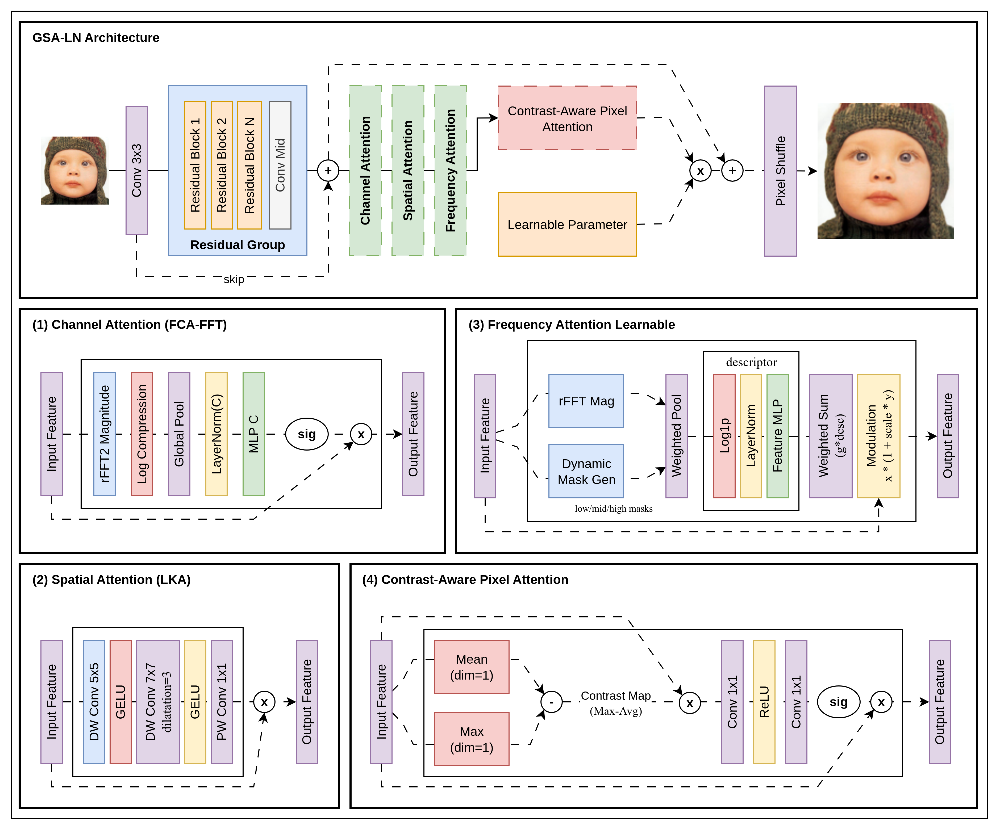

GSA-LN

Experimental implementation of the GSA-LN architecture, exploring hybrid spatial-channel-frequency attention mechanisms for next-generation super-resolution

## Pre-trained Models

Pre-trained models will be available soon.

## Datasets

| Type      | Dataset                                                                                             |
|-----------|-----------------------------------------------------------------------------------------------------|
| Training  | [DIV2K](https://data.vision.ee.ethz.ch/cvl/DIV2K/), [Flickr2K](https://www.kaggle.com/datasets/daehoyang/flickr2k) |
| Testing   | [Set5 & Set14](https://www.kaggle.com/datasets/ll01dm/set-5-14-super-resolution-dataset), [BSD100](https://www.kaggle.com/datasets/asilva1691/bsd100), [Urban100](https://www.kaggle.com/datasets/harshraone/urban100) |

## Performance

| Model | Scale | Params | Set5 | Set14 | BSD100 | Urban100 | Manga109 |
|---|---|---|---|---|---|---|---|
| GSA-LN | 2 | 2.6M | 38.14 | 33.78 | 32.26 | 32.56 | 39.19 |
| GSA-LN | 3 | 2.8M | 34.56 | 30.47 | 29.18 | 28.52 | 34.12 |
| GSA-LN | 4 | 3.1M | 32.34 | 28.73 | 27.65 | 26.33 | 30.89 |

---
This project is built on top of [BasicSR](https://github.com/XPixelGroup/BasicSR)